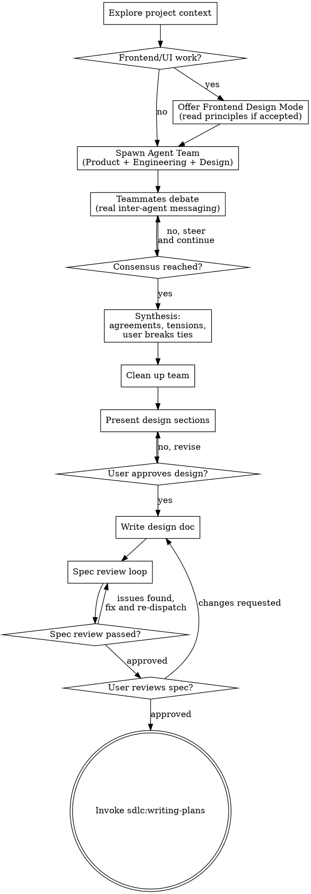

# Brainstorming Ideas Into Designs

## Audit Trail

Log skill invocation:

```bash
AUDIT_SCRIPT=$(find . -name "audit-trail.sh" -path "*/sdlc/*" 2>/dev/null | head -1)
[ -z "$AUDIT_SCRIPT" ] && AUDIT_SCRIPT=$(find "$HOME/.claude" -name "audit-trail.sh" -path "*/sdlc/*" 2>/dev/null | sort -V | tail -1)
AUDIT_SCRIPT=$(realpath "$AUDIT_SCRIPT" 2>/dev/null || echo "")
HOME_REAL=$(realpath "$HOME/.claude" 2>/dev/null || echo "")
PWD_REAL=$(realpath . 2>/dev/null || echo "")
case "$AUDIT_SCRIPT" in
  "$HOME_REAL"/*|"$PWD_REAL"/*) : ;;
  *) AUDIT_SCRIPT="" ;;
esac
```

- **Start:** `bash "$AUDIT_SCRIPT" log design sdlc:brainstorm started --context "$ARGUMENTS"`
- **End:** `bash "$AUDIT_SCRIPT" log design sdlc:brainstorm completed --context "<summary>"`

## Overview

Help turn ideas into fully formed designs and specs through collaborative dialogue with an Agent Team.

Start by understanding the current project context, then spawn a team of three specialists (Product, Engineering, Design) who explore the codebase, debate the idea with each other and with you, and converge on a design. Once consensus emerges, synthesize their findings, present the design, and get user approval.

<HARD-GATE>
Do NOT invoke any implementation skill, write any code, scaffold any project, or take any implementation action until you have presented a design and the user has approved it. This applies to EVERY project regardless of perceived simplicity.
</HARD-GATE>

## Anti-Pattern: "This Is Too Simple To Need A Design"

Every project goes through this process. A todo list, a single-function utility, a config change — all of them. "Simple" projects are where unexamined assumptions cause the most wasted work. The design can be short (a few sentences for truly simple projects), but you MUST present it and get approval.

## Checklist

You MUST create a task for each of these items and complete them in order:

1. **Explore project context** — check files, docs, recent commits
2. **Offer frontend-design mode** (if topic involves frontend/UI) — "Is this a frontend/UI task? I can apply design quality guidance for distinctive, non-generic output." If accepted, read `skills/brainstorm/frontend-design-principles.md` and enrich the Design teammate's spawn prompt with those principles. The Design teammate should push for specific aesthetic decisions: font character, palette direction, motion intent, compositional approach. The resulting spec should include a Visual Direction section. Additionally, check if `.claude/design-context.md` exists — if not, recommend running `sdlc:design init` after the brainstorm to establish design tokens before implementation begins.
3. **Spawn boardroom team** — create an Agent Team with Product, Engineering, and Design teammates
4. **Facilitate debate** — steer teammates, relay user input, let them challenge each other
5. **Synthesis** — summarize consensus from teammate findings, surface tensions, user breaks ties
6. **Present design** — in sections scaled to their complexity, get user approval after each section
7. **Write design doc** — save to `docs/specs/YYYY-MM-DD-<topic>-design.md` and commit
8. **Spec review loop** — dispatch spec-document-reviewer subagent with precisely crafted review context (never your session history); fix issues and re-dispatch until approved (max 5 iterations, then surface to human)
9. **User reviews written spec** — ask user to review the spec file before proceeding
10. **Transition to implementation** — invoke sdlc:writing-plans skill to create implementation plan

## Process Flow



**The terminal state is invoking sdlc:writing-plans.** Do NOT invoke any other implementation skill. The ONLY skill you invoke after brainstorming is sdlc:writing-plans.

## The Process

**Understanding the idea:**

- Check out the current project state first (files, docs, recent commits)
- Before asking detailed questions, assess scope: if the request describes multiple independent subsystems (e.g., "build a platform with chat, file storage, billing, and analytics"), flag this immediately. Don't spend questions refining details of a project that needs to be decomposed first.
- If the project is too large for a single spec, help the user decompose into sub-projects: what are the independent pieces, how do they relate, what order should they be built? Then brainstorm the first sub-project through the normal design flow. Each sub-project gets its own spec → plan → implementation cycle.
- For appropriately-scoped projects, spawn the boardroom team

## Agent Team Availability

Agent Teams require Claude Code v2.1.32+ and the `CLAUDE_CODE_EXPERIMENTAL_AGENT_TEAMS` environment variable set to `1`.

**Detection:** Before spawning the team, check availability:

1. Check the environment variable: `echo $CLAUDE_CODE_EXPERIMENTAL_AGENT_TEAMS` — must be `1`
2. If the variable is not set or not `1`, skip directly to Fallback Mode
3. If the variable is set but team creation fails (e.g., version too old), fall back immediately — do not retry

## Boardroom: Agent Team

Instead of simulating three personas in a single context, spawn three real Claude Code teammates. Each has its own context window, can explore the codebase independently, and communicates via inter-agent messaging.

**Creating the team:**

Tell Claude Code to create an agent team. Use natural language — the system handles the mechanics:

```
Create an agent team for brainstorming. Spawn three teammates:

1. "product" — You are the Product voice. Business-minded, scope-focused. Your job is to
   define the MVP, challenge scope creep, ask "who is this for?" and "what's the business
   value?" Explore the codebase to understand existing capabilities. Challenge Engineering
   on over-building. Challenge Design on features that don't serve the core use case.
   When you have a clear position on scope and MVP, message the team.

2. "engineering" — You are the Engineering voice. Technical, risk-aware. Your job is to
   assess architecture, identify what breaks, flag coupling and tech debt risks, and propose
   migration paths. Explore the codebase to understand current architecture and constraints.
   Challenge Product on feasibility. Challenge Design on implementation cost. When you have
   a clear technical assessment, message the team.

3. "design" — You are the Design voice. User-focused, detail-oriented. Your job is to
   define user flows, identify friction points, consider accessibility and mobile, and
   think about onboarding. Explore the codebase to understand existing UX patterns.
   Challenge Product on user impact. Challenge Engineering on UX compromises. When you
   have a clear UX position, message the team.

All three should explore the codebase first, then debate with each other via messages.
They should challenge each other's positions directly. Use Sonnet for all teammates.
```

Customize the spawn prompts with the specific idea/feature being brainstormed. Include:
- What the user wants to build (the idea)
- Any constraints or preferences the user has stated
- The project context you've gathered

**Your role as team lead:**

You are NOT a fourth persona. You are the facilitator:

1. **Relay user context** — when the user provides input, broadcast it to the team
2. **Steer debate** — if teammates are going in circles, redirect them. If one persona is dominating, prompt the quiet ones.
3. **Surface questions** — when a teammate asks something only the user can answer, relay it to the user and broadcast the answer back
4. **Monitor convergence** — watch for rough consensus on scope (Product), approach (Engineering), and UX (Design)
5. **Time-box** — if debate isn't converging after multiple rounds, summarize positions and ask the user to break ties

**When to stop the team:** When teammates have reached rough consensus on:
- What to build (scope/MVP) — Product's domain
- How to build it (architecture/approach) — Engineering's domain
- How it should feel (UX/design direction) — Design's domain

Or when the user has broken ties on unresolved tensions.

**Clean up:** After synthesis, shut down the teammates and clean up the team before proceeding to design presentation. Always clean up through the lead (you), not through teammates.

## Fallback Mode: Single-Agent Boardroom

If Agent Teams are unavailable (feature flag not set, version too old, or spawn fails), fall back to the original single-agent approach:

Simulate three personas in your own responses. This is NOT round-robin — write natural conversation where personas talk to each other and to the user.

**Personas:**

| Persona | Voice | Leads on |
|---|---|---|
| **Product** | Business-minded, scope-focused, asks "who is this for?" | MVP definition, prioritization, market fit, business value |
| **Engineering** | Technical, risk-aware, asks "what breaks?" | Architecture, scaling, coupling, migration paths, tech debt |
| **Design** | User-focused, detail-oriented, asks "how does this feel?" | User flows, friction, accessibility, mobile, onboarding |

**Conversation rules:**

1. All three personas react to the user's idea immediately — no waiting for turns
2. Personas talk TO EACH OTHER, not just to the user. They agree, disagree, challenge, and build on each other's points
3. When a persona needs user input, that persona asks directly
4. Personas aren't equal on every topic — each leads their domain but any can challenge any other
5. The conversation continues until rough consensus emerges on scope, approach, and design
6. After consensus, synthesize: areas of agreement, unresolved tensions, and ask the user to break ties

**Persona formatting:**

Each persona's dialogue is prefixed with their name in bold:

> **Product:** Invites are table stakes — but what's the MVP here?
>
> **Engineering:** Before we scope — do we even have a team model yet?
>
> **Design:** Neither of you is thinking about onboarding. What does a new user see?

**When to stop the boardroom:** When the three personas reach rough consensus on:
- What to build (scope/MVP)
- How to build it (architecture/approach)
- How it should feel (UX/design direction)

## After the Boardroom

Whether using Agent Teams or fallback mode, the remaining process is identical.

**Presenting the design:**

- Once you have consensus (from teammates or personas), present the design to the user
- Scale each section to its complexity: a few sentences if straightforward, up to 200-300 words if nuanced
- Ask after each section whether it looks right so far
- Cover: architecture, components, data flow, error handling, testing
- Be ready to go back and clarify if something doesn't make sense

**Design for isolation and clarity:**

- Break the system into smaller units that each have one clear purpose, communicate through well-defined interfaces, and can be understood and tested independently
- For each unit, you should be able to answer: what does it do, how do you use it, and what does it depend on?
- Can someone understand what a unit does without reading its internals? Can you change the internals without breaking consumers? If not, the boundaries need work.
- Smaller, well-bounded units are also easier for you to work with - you reason better about code you can hold in context at once, and your edits are more reliable when files are focused.

**Working in existing codebases:**

- Explore the current structure before proposing changes. Follow existing patterns.
- Where existing code has problems that affect the work, include targeted improvements as part of the design.
- Don't propose unrelated refactoring. Stay focused on what serves the current goal.

## After the Design

**Documentation:**

- Write the validated design (spec) to `docs/specs/YYYY-MM-DD-<topic>-design.md`
  - (User preferences for spec location override this default)
- Use clear, concise writing
- Commit the design document to git

**Security-sensitive features:** If the feature involves auth, payments, PII, external APIs, or user-generated content, mention `/sdlc:threat-model` as an optional next step: "This feature touches security-sensitive surfaces. Consider running `/sdlc:threat-model` to identify trust boundaries and abuse paths before implementation."

**Visual Direction section:** When frontend-design mode is active, the design doc MUST include a Visual Direction section with these fields: Aesthetic (chosen direction), Typography (font choices and pairing rationale), Color (palette character and key colors), Motion (animation philosophy and key moments), Composition (layout approach and spatial strategy), Content Plan (hero/support/detail/CTA sequence with one-line per section), Motion Budget (2-3 planned motion moments: entrance, scroll-linked, hover/reveal), Card Policy (cardless / cards for specific interactions only). This section is consumed by `writing-plans` to populate the plan's Design Constraints field.

**Spec Review Loop:**
After writing the spec document:

1. Dispatch spec-document-reviewer subagent using the Agent tool with `subagent_type="sdlc:spec-reviewer"`. Provide the spec file path and precisely crafted review context — never your session history.
2. If Issues Found: fix, re-dispatch, repeat until Approved
3. If loop exceeds 5 iterations, surface to human for guidance

**User Review Gate:**
After the spec review loop passes, ask the user to review the written spec before proceeding:

> "Spec written and committed to `<path>`. Please review it and let me know if you want to make any changes before we start writing out the implementation plan."

Wait for the user's response. If they request changes, make them and re-run the spec review loop. Only proceed once the user approves.

**Design System Bootstrap:** When frontend-design mode was active and no `.claude/design-context.md` exists, recommend `sdlc:design init` to establish design tokens before implementation. If accepted, invoke it before `sdlc:writing-plans`. If declined, proceed — constraints apply at review time regardless.

**Implementation:**

- Invoke the sdlc:writing-plans skill to create a detailed implementation plan
- Do NOT invoke any other skill. sdlc:writing-plans is the next step.

## Key Principles

- **YAGNI ruthlessly** - Remove unnecessary features from all designs
- **Incremental validation** - Present design, get approval before moving on
- **Be flexible** - Go back and clarify when something doesn't make sense
- **Real debate over theater** - Agent Teams produce genuine independent analysis; prefer them over simulated personas
