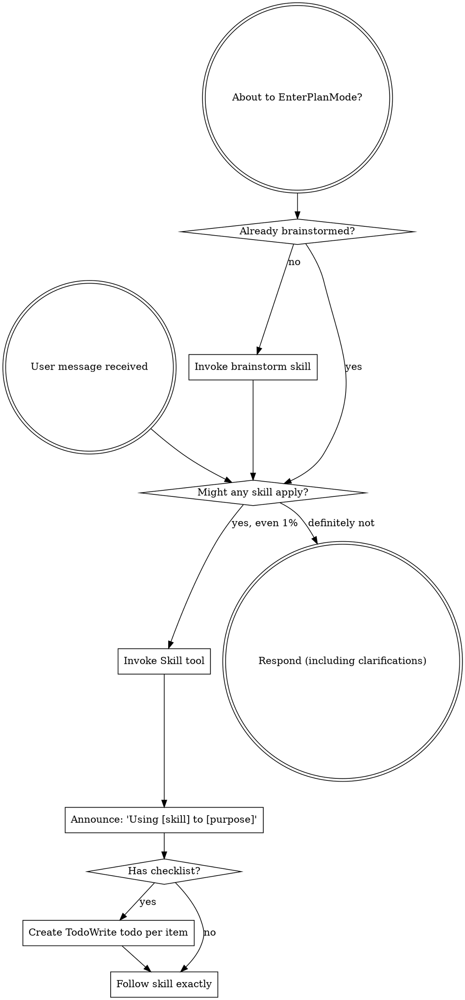

<SUBAGENT-STOP>
If you were dispatched as a subagent to execute a specific task, skip this skill.
</SUBAGENT-STOP>

<EXTREMELY-IMPORTANT>
If you think there is even a 1% chance a skill might apply to what you are doing, you ABSOLUTELY MUST invoke the skill.

IF A SKILL APPLIES TO YOUR TASK, YOU DO NOT HAVE A CHOICE. YOU MUST USE IT.

This is not negotiable. This is not optional. You cannot rationalize your way out of this.
</EXTREMELY-IMPORTANT>

## Instruction Priority

sdlc skills override default system prompt behavior, but **user instructions always take precedence**:

1. **User's explicit instructions** (CLAUDE.md, direct requests) — highest priority
2. **sdlc skills** — override default system behavior where they conflict
3. **Default system prompt** — lowest priority

If CLAUDE.md says "don't use TDD" and a skill says "always use TDD," follow the user's instructions. The user is in control.

## How to Access Skills

**In Claude Code:** Use the `Skill` tool. When you invoke a skill, its content is loaded and presented to you—follow it directly. Never use the Read tool on skill files.

# Using Skills

## The Rule

**Invoke relevant or requested skills BEFORE any response or action.** Even a 1% chance a skill might apply means that you should invoke the skill to check. If an invoked skill turns out to be wrong for the situation, you don't need to use it.

## Red Flags

These thoughts mean STOP—you're rationalizing:

| Thought | Reality |
|---------|---------|
| "This is just a simple question" | Questions are tasks. Check for skills. |
| "I need more context first" | Skill check comes BEFORE clarifying questions. |
| "Let me explore the codebase first" | Skills tell you HOW to explore. Check first. |
| "I can check git/files quickly" | Files lack conversation context. Check for skills. |
| "Let me gather information first" | Skills tell you HOW to gather information. |
| "This doesn't need a formal skill" | If a skill exists, use it. |
| "I remember this skill" | Skills evolve. Read current version. |
| "This doesn't count as a task" | Action = task. Check for skills. |
| "The skill is overkill" | Simple things become complex. Use it. |
| "I'll just do this one thing first" | Check BEFORE doing anything. |
| "This feels productive" | Undisciplined action wastes time. Skills prevent this. |
| "I know what that means" | Knowing the concept ≠ using the skill. Invoke it. |

## Skill Catalog

| Skill | When to invoke |
|-------|---------------|
| `brainstorm` | New feature, creative work, before any implementation |
| `writing-plans` | After spec approval, for detailed implementation planning |
| `plan` | Adopting a Claude-native plan, or resuming work without an sdlc-format plan |
| `pair-build` | Plan exists with unchecked items — default build skill (writer + critic pair) |
| `build` | Plan exists, manual fallback (single builder, no critic) |
| `subagent-build` | Plan exists, tasks are independent, subagents available |
| `review` | Build complete, needs code review |
| `ship` | Review complete, ready for PR |
| `finish-branch` | Implementation done, need to decide merge/PR/keep/discard |
| `parallel-dispatch` | Multiple independent failures or tasks |
| `bootstrap` | Missing bin/ scripts |
| `optimize-tests` | Slow test suite |
| `test-fixer` | Test quality issues, mocked tests, missing coverage, antipatterns |
| `performance-audit` | Codebase performance audit, antipattern detection, bottleneck analysis |
| `investigate` | Production bug, "why is this broken", 500 errors, Datadog/gcloud log dive, Slack alert thread |
| `pr-feedback` | PR open, review feedback to address (automated or human) |
| `dev` | Ambiguous intent, resuming work, need state detection |

## Skill Priority

When multiple skills could apply, use this order:

1. **Process skills first** (brainstorm, debugging) - these determine HOW to approach the task
2. **Workflow skills second** (plan, writing-plans, pair-build, build, subagent-build, review, ship, pr-feedback, finish-branch) - these guide execution
3. **Utility skills third** (parallel-dispatch, bootstrap, optimize-tests, performance-audit) - these solve specific problems

"Let's build X" → brainstorm first, then workflow skills.
"Fix this bug" → debugging first, then domain-specific skills.

## using-sdlc vs dev

`using-sdlc` and `dev` have distinct responsibilities:

- **`using-sdlc`** = discipline layer. Always active. Ensures every user message is checked against the skill catalog before responding. Routes to the right skill based on intent.
- **`dev`** = detection layer. Invoked explicitly via `/sdlc:dev` or when `using-sdlc` can't determine the right skill from intent alone. Runs diagnostics (branch state, plan status, gate results, PR status) to recommend the next phase.

**When `using-sdlc` routes directly:** User intent is clear — "let's brainstorm", "review this", "create a PR".

**When `using-sdlc` defers to `dev`:** User intent is ambiguous — "let's work on this", "what's next", "continue", or resuming a session mid-work.

## Skill Types

**Rigid** (TDD, debugging): Follow exactly. Don't adapt away discipline.

**Flexible** (patterns): Adapt principles to context.

The skill itself tells you which.

## User Instructions

Instructions say WHAT, not HOW. "Add X" or "Fix Y" doesn't mean skip workflows.
