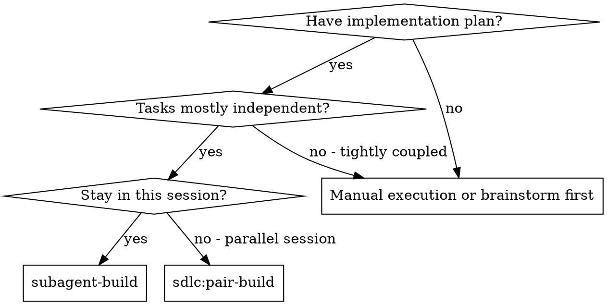
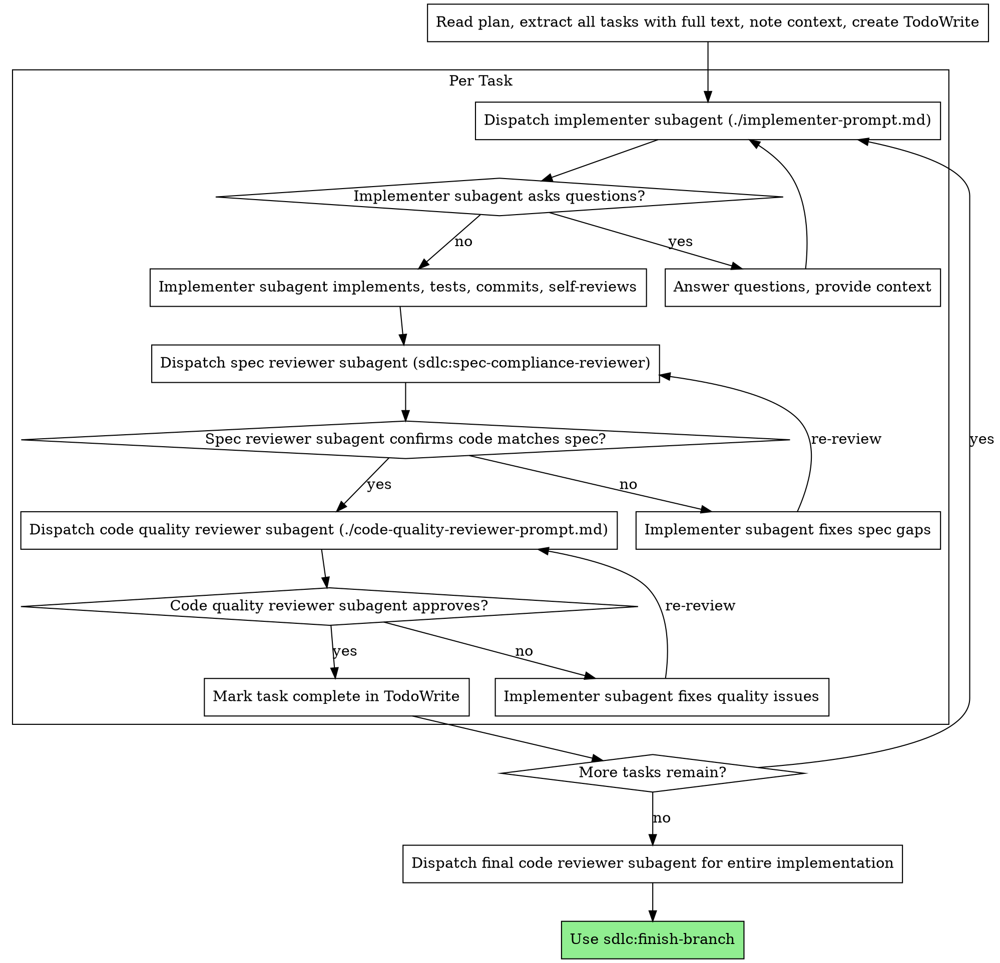

# Subagent-Driven Development

## Audit Trail

Log skill invocation:

```bash
AUDIT_SCRIPT=$(find . -name "audit-trail.sh" -path "*/sdlc/*" 2>/dev/null | head -1)
[ -z "$AUDIT_SCRIPT" ] && AUDIT_SCRIPT=$(find "$HOME/.claude" -name "audit-trail.sh" -path "*/sdlc/*" 2>/dev/null | sort -V | tail -1)
```

- **Start:** `bash "$AUDIT_SCRIPT" log build sdlc:subagent-build started --context="$ARGUMENTS"`
- **End:** `bash "$AUDIT_SCRIPT" log build sdlc:subagent-build completed --context="<summary>"`

Execute plan by dispatching fresh subagent per task, with two-stage review after each: spec compliance review first, then code quality review.

**Why subagents:** You delegate tasks to specialized agents with isolated context. By precisely crafting their instructions and context, you ensure they stay focused and succeed at their task. They should never inherit your session's context or history — you construct exactly what they need. This also preserves your own context for coordination work.

**Core principle:** Fresh subagent per task + two-stage review (spec then quality) = high quality, fast iteration

**NEVER truncate command output** with `| head`, `| tail`, or `| grep`. Redirect to a tmp file (`> /tmp/output.out 2>&1`) and Read the file. One run, full output. Include this rule in every subagent prompt you construct.

## When to Use



**vs. sdlc:pair-build (parallel session):**
- Same session (no context switch)
- Fresh subagent per task (no context pollution)
- Two-stage review after each task: spec compliance first, then code quality
- Faster iteration (no human-in-loop between tasks)

## The Process



**Note:** When `Test Strategy: pre-implementation` is active, the "Per Task" cluster expands to three phases (interface design → test writing → implementation) before reaching the review stages. The standard flow (single implementer) is unchanged for tasks without this flag.

## Model Selection

Use the least powerful model that can handle each role to conserve cost and increase speed.

**Mechanical implementation tasks** (isolated functions, clear specs, 1-2 files): use a fast, cheap model. Most implementation tasks are mechanical when the plan is well-specified.

**Integration and judgment tasks** (multi-file coordination, pattern matching, debugging): use a standard model.

**Architecture, design, and review tasks**: use the most capable available model.

**Test writing** (interface-to-test translation, constrained scope): use a cheap model. The test writer works from a narrow interface spec and doesn't need architectural judgment.

**Task complexity signals:**
- Touches 1-2 files with a complete spec -> cheap model
- Touches multiple files with integration concerns -> standard model
- Requires design judgment or broad codebase understanding -> most capable model

## Handling Implementer Status

Implementer subagents report one of four statuses. Handle each appropriately:

**DONE:** Proceed to spec compliance review.

**DONE_WITH_CONCERNS:** The implementer completed the work but flagged doubts. Read the concerns before proceeding. If the concerns are about correctness or scope, address them before review. If they're observations (e.g., "this file is getting large"), note them and proceed to review.

**NEEDS_CONTEXT:** The implementer needs information that wasn't provided. Provide the missing context and re-dispatch.

**BLOCKED:** The implementer cannot complete the task. Assess the blocker:
1. If it's a context problem, provide more context and re-dispatch with the same model
2. If the task requires more reasoning, re-dispatch with a more capable model
3. If the task is too large, break it into smaller pieces
4. If the plan itself is wrong, escalate to the human

**Never** ignore an escalation or force the same model to retry without changes. If the implementer said it's stuck, something needs to change.

**DONE_WITH_CONCERNS with CONFLICT_REASON:** When using the pre-implementation test pipeline (below), the implementer may report a `CONFLICT_REASON`:
- `SPEC_AMBIGUITY` → escalate to the developer for clarification. Pause the task.
- `INTERFACE_MISMATCH` → re-dispatch the test writer with the corrected interface spec from the implementer.

## Pre-Implementation Test Pipeline

When a plan task contains `**Test Strategy:** pre-implementation`, use a three-phase pipeline instead of the standard single-implementer flow:

### Phase 1: Interface Design

Dispatch the implementer with modified instructions:

> "Define the public API for this task. Write function/method signatures with types and error contracts. Do NOT implement any logic — use placeholder bodies that raise/throw. Commit this as the interface spec."

The implementer commits ONLY interface artifacts — no implementation bodies. The commit message should be: `chore: define interface for task N`

### Phase 2: Test Writing

Dispatch a **fresh test writer subagent** using `./test-writer-prompt.md`. Provide:
- The plan task text (full text, same as implementer)
- The interface artifact committed in Phase 1 (read the committed files)
- 2-3 existing test files from the repo (most recently modified test files in the same or parent directory)

The test writer commits failing tests: `test: write failing tests for task N`

Use haiku model by default. Escalate to sonnet if the test writer reports NEEDS_CONTEXT or BLOCKED.

### Phase 3: Implementation

Re-dispatch the implementer with modified instructions:

> "You will find failing tests already committed. Your job is to make them pass. You may ADD new tests but you may NOT modify, delete, or weaken any existing test assertions. If you believe a test is wrong, report DONE_WITH_CONCERNS with a CONFLICT_REASON — do not modify the test."

The implementer receives: plan task text, interface spec, and the committed test files.

### When NOT to Use

Tasks without `**Test Strategy:** pre-implementation` use the existing single-implementer flow unchanged. Integration/wiring tasks, config changes, and tasks without clear public interfaces should NOT use this pipeline.

## Prompt Templates

- `./implementer-prompt.md` - Dispatch implementer subagent
- `./test-writer-prompt.md` - Dispatch pre-implementation test writer subagent
- `./spec-reviewer-prompt.md` - Dispatch spec compliance reviewer subagent
- `./code-quality-reviewer-prompt.md` - Dispatch code quality reviewer subagent

## Red Flags

**Never:**
- Start implementation on main/master branch without explicit user consent
- Skip reviews (spec compliance OR code quality)
- Proceed with unfixed issues
- Dispatch multiple implementation subagents in parallel (conflicts)
- Make subagent read plan file (provide full text instead)
- Skip scene-setting context (subagent needs to understand where task fits)
- Ignore subagent questions (answer before letting them proceed)
- Accept "close enough" on spec compliance (spec reviewer found issues = not done)
- Skip review loops (reviewer found issues = implementer fixes = review again)
- Let implementer self-review replace actual review (both are needed)
- **Start code quality review before spec compliance is approved** (wrong order)
- Move to next task while either review has open issues

**If subagent asks questions:**
- Answer clearly and completely
- Provide additional context if needed
- Don't rush them into implementation

**If reviewer finds issues:**
- Implementer (same subagent) fixes them
- Reviewer reviews again
- Repeat until approved
- Don't skip the re-review

**If subagent fails task:**
- Dispatch fix subagent with specific instructions
- Don't try to fix manually (context pollution)

## Integration

**Required workflow skills:**
- **sdlc:writing-plans** - Creates the plan this skill executes
- **sdlc:finish-branch** - Complete development after all tasks

**Subagents should use:**
- TDD for each task

**Alternative workflow:**
- **sdlc:pair-build** - Use for parallel session instead of same-session execution
